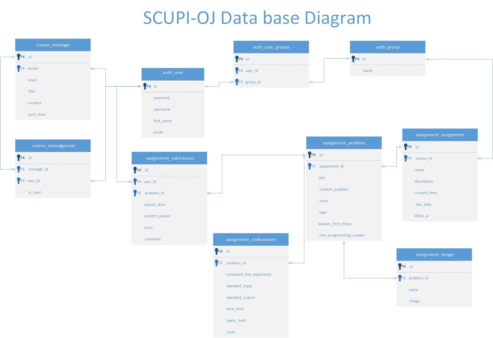

# SCUPI-ONLINE-JUDGE-SYSTEM

版本号：1.0.0-beta

## 一. 项目描述

### 项目背景
​四川大学匹兹堡学院计算机科学与技术专业自2022年成立以来尚未拥有适合计算机科学专业课程使用的OJ系统，虽然绝大多数课程选择使用Black board 作为作业的线上提交门户，但Black board总体上是为传统文字作业所设计的 ，对于计算机编程类作业的支持并不理想。特别是在算法和数据结构、编程语言学习、计算机系统基础等课程中，学生需要一个能够即时反馈编程作业结果和性能的平台。由此计算机专业课，的作业部分产生了一些问题，如TA判分随意性大等。 因此，四川大学匹兹堡学院计算机科学与技术专业迫切需要一个专门的在线评测系统（Online Judge，简称OJ），以更好地支持编程教学和实践，帮助学生检验和提升编程能力。在与老师和学生进行充分讨论，了解各方需求后，本项目应运而生。

### 主要功能
1.0.0-beta版本基本实现了基于课程为单位的作业的增删改查功能，支持的题目类型有选择题（支持多选），简答题，编程题，其中编程题支持同目录下多文件代码功能的判题，现今支持cpp和java语言，编程题判例设置支持设置命令行参数，标准输入，时间内存限制，符合编程语言课，数据结构与算法等课程的使用要求。简答题在1.0.0-beta版本只支持人工批改评分，在未来的开发中会接入AI助教功能。

### 后端技术栈

项目开发：Django，Django-rest-framework，JWT，Docker，简单的Cpp多线程，shell，Celery（用于定时/异步脚本，守护进程）

部署与维护：Apache/Nginx，uwsgi，Mysql（不用学习详细的SQL，懂得基础的数据库知识，会使用phpmyadmin）

## 二. 开发环境搭建（基于Windows本机环境）

1. [官网下载并安装WampServer]([WampServer, la plate-forme de développement Web sous Windows - Apache, MySQL, PHP](https://www.wampserver.com/en/))可参考[bilibili视频]([WampServer视频教程_哔哩哔哩_bilibili](https://www.bilibili.com/video/BV1gJ411x7WT/?spm_id_from=333.337.search-card.all.click&vd_source=3ea11c6471f4ecd3b36df28586aea0fa))

2. 初始化Mysql root密码，可参考以上bilibili视频

3. ```shell
   git clone https://github.com/LinZiyang666/SCUPI-online-judge-system.git ;  cd .\SCUPI-online-judge-system\ ;  pip install -r requirements.txt
   ```

   若mysqlclient安装失败请手动```pip install mysqlclient```

4. (由实际情况决定)

   * 请设置scupioj/setting.py 中数据库用户名称，密码与使用的数据库

   * ```shell
     python3 ./manage.py makemigrations; 
     python3 ./manage.py migrate;
     python3 ./manage.py init_site
     ```

5. [安装docker]([Docker Desktop: The #1 Containerization Tool for Developers | Docker](https://www.docker.com/products/docker-desktop/))并启动

6. 安装WSL，以Ubuntu作为发行版，windows家庭版与专业版安装方式有区别，请根据自身系统版本上网查找

7. 在WSL中进入SCUPI-online-judge-system/docker/

   分别运行：

   * ```shell
     cd cpp_sandbox && bash ./initialize.sh 
     ```

   * ```shell 
     cd java_sandbox && bash ./initialize.sh
     ```

​	若因网络原因安装失败请重试```bash ./initialize.sh```

## 架构描述

本项目采取前后端分离式架构，前后端通过api交流。

### 后端架构

### MVT（Model-View-Template）

- **Model（模型）**：负责处理应用程序的数据逻辑。它直接管理数据、逻辑和规则。可以理解为数据库（不只是数据库，但可以当数据库理解）得益于Django ORM，我们只用设计数据库的结构，具体设计在Django每个app的model.py中。

- **View（视图）**：负责显示数据（模型）给用户。一个模型可以有多个视图。位于每个Django app的view.py中，在本项目中，view通过restful api与前端沟通。

- **Template（模板）**： 负责渲染用户界面，即呈现数据给用户。（本项目前后端分离，这里不用考虑）

  

### 数据库设计

具体用到的数据库结构如下：

## 代码书写规范
### 遵循PEP 8
>缩进：使用4个空格作为缩进。
行长度：尽量限制代码行的长度，通常不超过79个字符。
空白：避免在方括号、花括号、括号内使用额外的空格。
导入：每个导入应该分开一行。
命名规范：
类名使用驼峰命名法（CamelCase）。
函数名和变量名使用小写字母，并用下划线分隔（snake_case）。
常量使用全部大写字母，并用下划线分隔。


