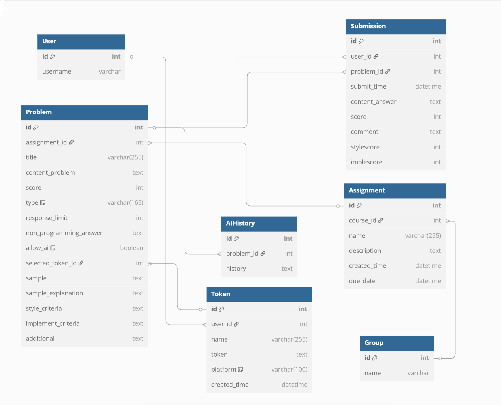

# SCUPI ONLINE JUDGE SYSTEM

Version: 2.1.2

**[Changelog](./CHANGELOG.md)**

**[中文README文档](./README.zh-CN.md)**

---

## I. Project Description

### Project Background

Since the establishment of the Computer Science and Technology major at Sichuan University-Pittsburgh Institute (SCUPI) in 2022, the institute has lacked an Online Judge (OJ) system tailored specifically for computer science courses. Although most courses utilize Blackboard as an online assignment submission platform, Blackboard is primarily designed for traditional text-based assignments and is inadequate for programming assignments. This limitation is particularly noticeable in courses such as Algorithms and Data Structures, Programming Language Learning, and Computer Systems Foundations, where students need instant feedback on their programming results and performance. Consequently, several issues have arisen, such as subjective grading by teaching assistants. Therefore, there is an urgent need at SCUPI for a dedicated OJ system to better support programming teaching and practice, helping students validate and improve their coding skills. After extensive discussions with faculty and students and understanding their requirements, this project was initiated.

### Main Features

The 1.0.0 version implemented basic CRUD functionalities for course-based assignments, supporting question types such as multiple-choice (including multiple answers), short-answer, and programming problems. The programming problems support multi-file submissions within the same directory, currently accepting cpp and java languages. It allows setting command-line arguments, standard input, and time/memory constraints, meeting the requirements of courses like programming languages, data structures, and algorithms. Short-answer questions only support manual grading in version 1.0.0.

In version 2.0.0, the platform integrates a dynamic AI-assisted evaluation system capable of intelligently grading programming problems based on code style and implementation. The platform also provides a comprehensive API Token management system and designed AI evaluation templates supporting multiple generative AI platforms, including ChatGPT, Deepseek, Gemini, etc.

### Backend Technology Stack

- **Development:** Django, Django REST framework, JWT, Docker, basic multi-threading in C++, Shell scripting, Celery (for scheduled/asynchronous tasks and daemon processes).
- **Deployment and Maintenance:** Apache/Nginx, uWSGI, MySQL (basic database knowledge required, no detailed SQL needed; familiarity with phpMyAdmin usage).

## II. Development Environment Setup (Windows Local Environment)

1. [Download and install WampServer](https://www.wampserver.com/en/).

2. Initialize MySQL root password.

3. ```
   git clone https://github.com/LinZiyang666/SCUPI-online-judge-system.git
   cd .\SCUPI-online-judge-system\
   pip install -r requirements.txt
   ```

   If `mysqlclient` installation fails, install manually with:

   ```
   pip install mysqlclient
   ```

4. (As needed)

   - Set database username, password, and database name in `scupioj/setting.py`.
   - Execute:

   ```
   python3 ./manage.py makemigrations
   python3 ./manage.py migrate
   python3 ./manage.py init_site
   ```

5. [Install Docker](https://www.docker.com/products/docker-desktop/) and start it.

6. Install WSL using Ubuntu distribution. Installation varies between Windows Home and Pro editions; please look up online according to your system version.

7. Enter `SCUPI-online-judge-system/docker/` in WSL and run:

   - ```
     cd cpp_sandbox && bash ./initialize.sh
     ```

   - ```
     cd java_sandbox && bash ./initialize.sh
     ```

   Retry with `bash ./initialize.sh` if installation fails due to network issues.

## Architecture Description

This project adopts a frontend-backend separated architecture, with communication via APIs.

### Backend Architecture

#### MVT (Model-View-Template)

- **Model:** Manages the application's data logic, rules, and structure. Thanks to Django ORM, database structure design is simplified and implemented in each Django app's `model.py`.
- **View:** Presents data (model) to users. Located in each Django app’s `view.py`; views communicate with the frontend through RESTful APIs.
- **Template:** Renders the user interface (not applicable here due to frontend-backend separation).

### Database Design

The database structure used: 

New database structure in version 2.0.0: 